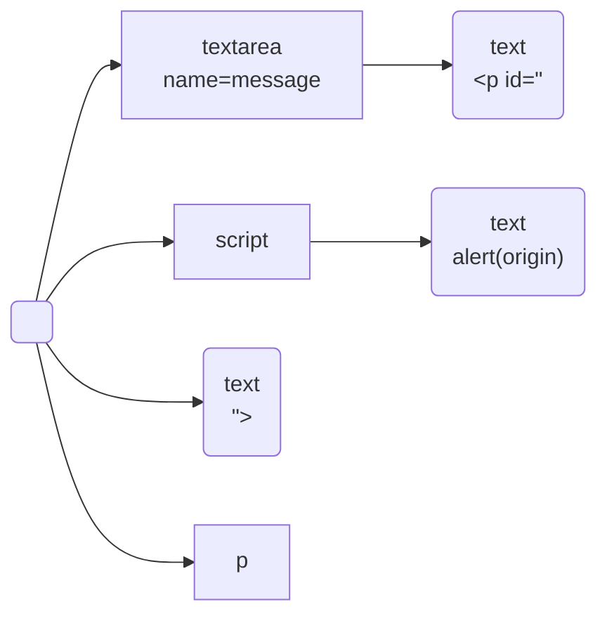

# HTML パーサー自作で理解する Flatt Security XSS Challenge 1

最近、[『［作って学ぶ］ブラウザのしくみ』](https://gihyo.jp/book/2024/978-4-297-14546-0)という本を参考に[自作ブラウザ](https://github.com/pizzacat83/sabatora)をちまちま作っている。今は HTML パーサーの章まで進めたところなのでまだブラウザと呼べるものではないものの。

ところで自作ブラウザの要素の一つとして HTML パーサーをせっかく作ったので、ずっと苦手意識を持っていた mXSS 的な問題の理解を、HTML パーサー自作を通して深めたいと思った。

去年の11月に公開された [Flatt Security XSS Challenge](https://github.com/flatt-jp/flatt-xss-challenges) の1問目はまさに、コンテキストの違いによる HTML パースのズレによって DOMPurify によるサニタイズを潜り抜けて XSS をする challenge だった。そこでこの challenge を題材に HTML パースの仕様に deep dive して、パース結果がズレるメカニズムを理解したいと思う。

## Challenge と解法の概要

公式解説はこちら:

<iframe class="speakerdeck-iframe" frameborder="0" src="https://speakerdeck.com/player/b62cac2f020f47af8ad709548617eb94" title="Flatt Security XSS Challenge 解答・解説" allowfullscreen="true" style="border: 0px; background: padding-box padding-box rgba(0, 0, 0, 0.1); margin: 0px; padding: 0px; border-radius: 6px; box-shadow: rgba(0, 0, 0, 0.2) 0px 5px 40px; width: 100%; height: auto; aspect-ratio: 560 / 315;" data-ratio="1.7777777777777777"></iframe>

ユーザー入力を元に、以下の EJS テンプレートがレンダリングされる。`<%- %>` でコンテンツを挿入している箇所が2つあり、ここでは EJS によるエスケープはなされない。

```html
<!-- index.ejs -->
<html>
<head>
    <title>✈️ Paper Airplane</title>
    <link rel="stylesheet" href="design.css">
</head>
<body>
<div class="card">
	<h1>Paper Airplane</h1>
    <p class="message"><%- sanitized %></b></p>
    <form method="get" action="">
        <textarea name="message"><%- sanitized %></textarea>
        <p>
            <input type="submit" value="View 👀" formaction="/" />
        </p>
    </form>
</div>
</div>

</body>
</html>
```

しかし挿入される変数名が `sanitized` であることから推測できるように、エスケープされずに挿入されるコンテンツは、ユーザー入力 `message` に対して DOMPurify がサニタイズをした結果である。

```js
// index.js
app.get('/', (req, res) => {
  const message = req.query.message;
  // ...
  const sanitized = DOMPurify.sanitize(message);
  res.view("/index.ejs", { sanitized: sanitized });
});
```

したがって、`<script>alert(origin)</script>` のような自明なペイロードは、DOMPurify によって無害化されてしまう。

解答は、ユーザー入力 `message` として以下のペイロードを送信することである。
```html
<p id="</textarea><script>alert(origin)</script>"></p>
```

上記の文字列を DOMPurify でサニタイズすると、同じ文字列がそのまま出てくる。これは [DOMPurify のデモページ](https://cure53.de/purify) で手軽に確認できる。

サニタイズの結果文字列が変化しなかったのは当たり前のように思える。上記の HTML は、「`p` タグであり、`id` 属性が `</textarea><script>alert(origin)</script>` であるような要素」を表すからだ。

それにもかかわらず、上記ペイロードはスクリプトを実行させることができる。`script` タグが出現してしまうのはテンプレート中の以下の挿入箇所である。
```html
<textarea name="message"><%- sanitized %></textarea>
```

ここにサニタイズ結果を挿入すると、次のようになる。
```
<textarea name="message"><p id="</textarea><script>alert(origin)</script>"></p></textarea>
```

実は、この HTML をブラウザは以下のように解釈してしまう。

- textarea 開始タグ `<textarea name="message">`
- **textarea 要素内のテキストコンテンツ** `<p id="`
- **textarea 終了タグ** `</textarea>` 
- script 開始タグ `<script>`
- script 要素内のテキスト `alert(origin)`
- script 終了タグ `</script>`
- テキストコンテンツ `">`
- p 終了タグ `</p>`
- textarea 終了タグ `</textarea>`

その結果 DOM ツリーは以下のようになる。



このパース結果のポイントは、`<textarea name="message"><p id="</textarea>` の部分の解釈が「`textarea` 要素の子要素となる `p` 開始タグの中で属性 `id` を記述している途中」ではなく、「`<textarea>` と `</textarea>` の間に、テキストコンテンツ `<p id="` が挟まれている」となることである。

一方で、ユーザー入力を取り囲んでいたタグが `textarea`  ではなく例えば `div` だった場合は、上記の挙動は起こらない。`<div><p id="</div><script>alert(origin)</script>"></p></div>` をパースすると、問題の箇所は「`p` タグであり、`id` 属性が `</div><script>alert(origin)</script>` である要素」として解釈される。

外側のタグが `textarea` か `div` かでこのような違いが生まれるのはなぜだろうか。

本題に入る前に、パーサーに深入りしない説明を書いておく。

HTML Living Standard の [13.1 Writing HTML documents](https://html.spec.whatwg.org/multipage/syntax.html#elements-2)において、`textarea` は [escapable raw text elements](https://html.spec.whatwg.org/multipage/syntax.html#escapable-raw-text-elements) というカテゴリ、`div` は [normal elements](https://html.spec.whatwg.org/multipage/syntax.html#normal-elements) というカテゴリに含まれる。

Escapable raw text elements の中に含めることができるものは、以下のように言及されている。
> Escapable raw text elements can have **text and character references**, but the text must not contain an ambiguous ampersand. There are also further restrictions described below.
>
> (略)
>
> The text in raw text and escapable raw text elements must not contain any occurrences of the string "&lt;/" (U+003C LESS-THAN SIGN, U+002F SOLIDUS) followed by characters that case-insensitively match the tag name of the element followed by one of U+0009 CHARACTER TABULATION (tab), U+000A LINE FEED (LF), U+000C FORM FEED (FF), U+000D CARRIAGE RETURN (CR), U+0020 SPACE, U+003E GREATER-THAN SIGN (&gt;), or U+002F SOLIDUS (/).

一方 normal elements については次のように述べられている。
> Normal elements can have **text, character references, other elements, and comments**, but the text must not contain the character U+003C LESS-THAN SIGN (<) or an ambiguous ampersand.

Normal elements の中には他の要素やコメントを書くことができるが、escapable raw text elements の中にそれらを書くことはできない。また、normal elements の中でテキストを書く際には、`<` を書いてはいけない。タグの先頭と誤解されてしまいかねないからだ。一方で escapable raw text elements の中でテキストを書く際の制約はもう少し寛容である。例えば `textarea` 要素の中のテキストとして `</textarea>` と書いてはいけないが、`</` の直後の文字列が `textarea` 以外であれば許容される。つまり、`textarea` 内のテキストとして、`<p id="` という文字列を書くことは許されているのだ。

さて、このようなパースの違いがどのように実現されているのか、HTML パース処理の仕様を見ていこう。

## HTML パーサーの中を覗く

これまで説明したパースの挙動を、自作 HTML パーサーで再現することで理解を深めたいと思う。

ただ、この challenge の HTML は色々な HTML タグを利用していて、自作 HTML パーサーでそれら全てのパースに対応するのは、ちょっと骨が折れる。そこで Challenge と同様の挙動を再現できる以下の HTML を用意した。このパースができるよう、自作 HTML パーサーを拡張した。

```html
<html>
<head>
</head>
<body>
    <p id="</textarea><script>alert(origin);</script>"></p>
    <textarea name="message"><p id="</textarea><script>alert(origin);</script>"></p></textarea>
</body>
</html>
```

パース結果:[^handmade-parser-result]
```
|- Document
   |- Element(Element { kind: Html, attributes: [] })
      |- Element(Element { kind: Head, attributes: [] })
      |- Text("\n")
      |- Element(Element { kind: Body, attributes: [] })
         |- Element(Element { kind: P, attributes: [Attribute { name: "id", value: "</textarea><script>alert(origin);</script>" }] })
         |- Element(Element { kind: Textarea, attributes: [Attribute { name: "name", value: "message" }] })
            |- Text("<p id=\"")
         |- Element(Element { kind: Script, attributes: [] })
            |- Text("alert(origin);")
         |- Text("\">")
         |- Element(Element { kind: P, attributes: [] })
```

[^handmade-parser-result]: 4行目に改行文字のテキストが入っているのはおかしい気がするが、まだ原因を見つけられていない。

確かに、HTML の4行目は「`p` タグであり、`id` 属性が `</textarea><script>alert(origin)</script>` であるような要素」として解釈され、`<textarea>` で囲われている5行目は「`<textarea>` と `</textarea>` の間に、テキストコンテンツ `<p id="` が挟まれている」と解釈されている。

パース処理の仕様は HTML Living Standard [13.2 Parsing HTML documents](https://html.spec.whatwg.org/multipage/parsing.html) に定義されている。パースの主な処理は、tokenization stage と tree construction stage に分けられる。Tokenization stage は文字列をトークンの列に変換し、tree construction stage はトークンの列から DOM を構築する。どちらの stage もそれぞれ state machine を持っていて、文字やトークンを消費して自身の状態を変える。なお、tree construction stage は自身の状態だけでなく、tokenization stage の状態を変更することもあることに注意が必要だ。大域的には、2つの stage を独立に捉えることはできない。

件のペイロードの挙動は、幸い tokenization stage にのみ注目するので十分だ。`<p id="</textarea><script>alert(origin)</script>"></p>` の部分をパースする間は、「tree construction stage  が tokenization stage の状態を変える」ステップは存在しない。

まず、 `<textarea>` で囲われていない5行目をパースするときの、tokenizer の挙動を見ていこう。Tokenizer が `<p id="...` の先頭を読む直前では、tokenizer は data state にある。その後の状態遷移は以下の通り:


| state                           | input                                                                                                                                                                   | next state                      | emit                                                                                           | draft token                                                                                    | note                        |
| ------------------------------- | ----------------------------------------------------------------------------------------------------------------------------------------------------------------------- | ------------------------------- | ---------------------------------------------------------------------------------------------- | ---------------------------------------------------------------------------------------------- | --------------------------- |
| data                            | `<`                                                                                                                                                                     | tag open                        |                                                                                                |                                                                                                |                             |
| tag open                        | `p`                                                                                                                                                                     | tag name                        |                                                                                                | start tag                                                                                      | reconsume                   |
| tag name                        | `p`                                                                                                                                                                     | tag name                        |                                                                                                | start tag<br>name: `p`                                                                         |                             |
| tag name                        | <code>&nbsp;</code>                                                                                                                                                                     | before attribute name           |                                                                                                | start tag<br>name: `p`                                                                         |                             |
| before attribute name           | `i`                                                                                                                                                                     | attribute name                  |                                                                                                | start tag<br>name: `p`                                                                         | reconsume                   |
| attribute name                  | `i`                                                                                                                                                                     | attribute name                  |                                                                                                | start tag<br>name: `p`<br>attributes:<br>- `i`                                                 |                             |
| attribute name                  | `d`                                                                                                                                                                     | attribute name                  |                                                                                                | start tag<br>name: `p`<br>attributes:<br>- `id`                                                |                             |
| attribute name                  | `=`                                                                                                                                                                     | before attribute value          |                                                                                                | start tag<br>name: `p`<br>attributes:<br>- `id`                                                |                             |
| before attribute value          | `"`                                                                                                                                                                     | attribute value (double-quoted) |                                                                                                | start tag<br>name: `p`<br>attributes:<br>- `id`                                                |                             |
| attribute value (double-quoted) | `</textarea><script>alert(origin);</script>` | attribute value (double-quoted) |                                                                                                | start tag<br>name: `p`<br>attributes:<br>- `id` : `</textarea><script>alert(origin);</script>` | どの文字も同じ遷移をするので、この表では1行にまとめた |
| attribute value (double-quoted) | `"`                                                                                                                                                                     | after attribute value (quoted)  |                                                                                                | start tag<br>name: `p`<br>attributes:<br>- `id` : `</textarea><script>alert(origin);</script>` |                             |
| after attribute value (quoted)  | `>`                                                                                                                                                                     | data                            | start tag<br>name: `p`<br>attributes:<br>- `id` : `</textarea><script>alert(origin);</script>` |                                                                                                |                             |
| data                            | `<`                                                                                                                                                                     | tag open                        |                                                                                                |                                                                                                |                             |
| tag open                        | `/`                                                                                                                                                                     | end tag open                    |                                                                                                |                                                                                                |                             |
| end tag open                    | `p`                                                                                                                                                                     | tag name                        |                                                                                                | end tag                                                                                        |                             |
| tag name                        | `p`                                                                                                                                                                     | tag name                        |                                                                                                | end tag<br>name: `p`                                                                           |                             |
| tag name                        | `>`                                                                                                                                                                     | data                            | end tag<br>name: `p`                                                                           |                                                                                                |                             |

Tokenizer は `<p id="...` の部分について、まず `<` を読んでタグの始まりを認識し、tag open state に遷移する。そして `p` を読んで開始タグのタグ名部分を認識し、空白文字まで読んでタグ名の終了を認識する。その後属性や開始タグの末尾も認識し、「`id` 属性が `</textarea><script>alert(origin)</script>` である `p` 開始タグ」というトークンを出力する。

一方、`<textarea>` で囲われている6行目のペイロード部分における、tokenizer の挙動を見ていく。Tokenizer が `<textarea>` まで読み終えて `<p id="...` をこれから読むというタイミングでは、tokenizer は data state ではなくRCDATA state にある。その後の状態遷移は以下の通り:


| state                 | input                       | next state            | emit                       | draft token                 | note                        |
| --------------------- | --------------------------- | --------------------- | -------------------------- | --------------------------- | --------------------------- |
| RCDATA                | `<`                         | RCDATA less-than sign |                            |                             |                             |
| RCDATA less-than sign | `p`                         | RCDATA                | char `<`                   |                             | reconsume                   |
| RCDATA                | `p`                         | RCDATA                | char `p`                   |                             |                             |
| RCDATA                | <code>&nbsp;</code>                         | RCDATA                |                            |                             |                             |
| RCDATA                | `i`                         | RCDATA                |                            |                             |                             |
| RCDATA                | `d`                         | RCDATA                |                            |                             |                             |
| RCDATA                | `=`                         | RCDATA                |                            |                             |                             |
| RCDATA                | `"`                         | RCDATA                | char `"`                   |                             |                             |
| RCDATA                | `<`                         | RCDATA less-than sign |                            |                             |                             |
| RCDATA less-than sign | `/`                         | RCDATA end tag open   |                            |                             |                             |
| RCDATA end tag open   | `t`                         | RCDATA end tag name   |                            |                             | reconsume                   |
| RCDATA end tag name   | `t`                         | RCDATA end tag name   |                            | end tag<br>name: `t`        |                             |
| RCDATA end tag name   | `e` `x` `t` `a` `r` `e` `a` | RCDATA end tag name   |                            | end tag<br>name: `textarea` | どの文字も同じ遷移をするので、この表では1行にまとめた |
| RCDATA end tag name   | `>`                         | data                  | end tag<br>tag: `textarea` |                             |                             |


Tokenizer はまず `<` を読み、RCDATA less-than sign state に遷移する。次に `p` を読むと、なんと文字トークン `<` を出力して RCDATA state に戻ってしまう。`<` という文字を、タグの開始ではなく、`<` という文字そのものとして解釈してしまったのだ。その後も、`<p id="` の部分を文字列リテラルとして解釈していってしまう。

次に読む文字は `</textarea>` の先頭にある `<` で、また RCDATA less-than sign state に遷移する。`/` を読むと、今度は RCDATA end-tag open state に遷移する。その次に `t` を読み、終了タグのタグ名を認識する状態に遷移する。そして `textarea` の残りの部分を1文字ずつ読み進める。最後に RCDATA end tag name state の状態で、入力文字が `>` であるときの処理は、以下のように定義されている。

> U+003E GREATER-THAN SIGN (&gt;)  
>If the current end tag token is an appropriate end tag token, then switch to the data state and emit the current tag token. Otherwise, treat it as per the "anything else" entry below.

Appropriate end tag token であるとは、今認識している終了タグのタグ名が、直近の開始タグのタグ名と合致していることとして定義されている。今回の場合、直近の開始タグは `<textarea>` であるから、appropriate end tag token とは、まさに textarea の終了タグである。

したがって tokenizer は `>` を読むと、終了タグ `</textarea>` を表すトークンを出力して data state に遷移する。そして、`<script>` 以降を script 要素として解釈してしまうのである。

運命の分かれ目は、`<` の後に続く `p` を読んだ時の処理であるといえよう。`<` を読み終わった後の state は、5行目のケースでは tag open state, 6行目のケースでは RCDATA less-than sign state であった。それぞれの state で tokenizer がすべき処理は以下のように異なる。


> 13.2.5.6 Tag open state  
> Consume the next input character:
> 
> - **U+0021 EXCLAMATION MARK (!)**
> 	- Switch to the markup declaration open state.
> - **U+002F SOLIDUS (/)**
> 	- Switch to the end tag open state.
> - **ASCII alpha**
> 	- Create a new start tag token, set its tag name to the empty string. Reconsume in the tag name state.
> - U+003F QUESTION MARK (?)
> 	- This is an unexpected-question-mark-instead-of-tag-name parse error. Create a comment token whose data is the empty string. Reconsume in the bogus comment state.
> - EOF
> 	- This is an eof-before-tag-name parse error. Emit a U+003C LESS-THAN SIGN character token and an end-of-file token.
> - Anything else
> 	- This is an invalid-first-character-of-tag-name parse error. Emit a U+003C LESS-THAN SIGN character token. Reconsume in the data state.


<!--  -->

> 13.2.5.9 RCDATA less-than sign state  
> Consume the next input character:
> 
> - **U+002F SOLIDUS (/)**
> 	- Set the temporary buffer to the empty string. Switch to the RCDATA end tag open state.
> - Anything else
> 	- Emit a U+003C LESS-THAN SIGN character token. Reconsume in the RCDATA state.

Tag open state は `<` の後に来る文字として `!`, `/`, アルファベットなどに関心がある。それぞれコメント、終了タグ、開始タグに関連する文字である。一方で、RCDATA less-than sign state は `/` にしか関心がなく、`/` 以外の文字が来ると、`<` という文字そのものを表すトークンを出力して RCDATA state に戻ってしまう。RCDATA end tag name state における appropriate end tag token のチェックからも分かるように、RCDATA less-than sign state から始まる状態遷移では、textarea の終了タグを認識することにしか関心がない、という捉え方ができる。

ここで escapable raw text element の仕様を再掲すると、RCDATA 系の状態遷移系列との対応が見て取れる。

> The text in raw text and escapable raw text elements must not contain any occurrences of the string "&lt;/" (U+003C LESS-THAN SIGN, U+002F SOLIDUS) followed by characters that case-insensitively match the tag name of the element followed by one of U+0009 CHARACTER TABULATION (tab), U+000A LINE FEED (LF), U+000C FORM FEED (FF), U+000D CARRIAGE RETURN (CR), U+0020 SPACE, U+003E GREATER-THAN SIGN (&gt;), or U+002F SOLIDUS (/).

以上で、`<textarea>` に囲まれているかどうかで HTML パーサーがどのような異なる挙動をするのかを、より詳細に理解できた。ところで、そもそも `<textarea>` で囲まれている場合の初期状態がなぜ data state ではなく RCDATA state なのかの説明を飛ばしていたので、ここを明らかにする。

結論から言えば、textarea 開始タグを表すトークンを消費した tree construction stage が、tokenizer の state を書き換えたためである。パース処理の概要説明にて「tree construction stage は自身の状態だけでなく、tokenization stage の状態を変更することもある」と述べたが、それがここで起きていたのだ。

textarea 開始タグを消費する直前で、tree construction stage の state machine の状態 (仕様書では insertion mode と記載されている) は "in body" insertion mode である。この mode で textarea 開始タグを受け取った時の処理は以下のように定義されている。

> When the user agent is to apply the rules for the "[in body](https://html.spec.whatwg.org/multipage/parsing.html#parsing-main-inbody)" [insertion mode](https://html.spec.whatwg.org/multipage/parsing.html#insertion-mode), the user agent must handle the token as follows:
> (略)
> 
> - A start tag whose tag name is "textarea"
> 	- Run these steps:
> 		1. Insert an HTML element for the token.
> 		2. If the next token is a U+000A LINE FEED (LF) character token, then ignore that token and move on to the next one. (Newlines at the start of textarea elements are ignored as an authoring convenience.)
> 		3. **Switch the tokenizer to the RCDATA state.**
> 		4. Let the original insertion mode be the current insertion mode.
> 		5. Set the frameset-ok flag to "not ok".
> 		6. Switch the insertion mode to "text".

一方で、textarea ではなく div の開始タグを受け取った場合の処理には、tokenizer の state を書き換える処理はない。

> - A start tag whose tag name is one of: "address", "article", "aside", "blockquote", "center", "details", "dialog", "dir", "**div**", "dl", "fieldset", "figcaption", "figure", "footer", "header", "hgroup", "main", "menu", "nav", "ol", "p", "search", "section", "summary", "ul"
> 	1. If the stack of open elements has a p element in button scope, then close a p element.
> 	2. Insert an HTML element for the token.

開始タグが textarea かどうかで tokenizer の state が変化するため、後続する文字列の字句解析結果が別物となったのだ。

まあなんというか、「textarea の子要素はフォームの入力値として扱われるから、子要素を書きたいシチュエーションはない」は納得できるが、「textarea の子はテキストノードのみであり、それはパース後のバリデーションではなく字句解析処理の変化によって保証される」というのは驚きである。そして字句解析処理の state を tree construction stage が変更するのもまた驚きである。Tokenization state 側で、「textarea 開始タグを出力する際は、RCDATA state に遷移する」という遷移規則にしておく方が直感的ではなかろうか。しかし、そういうタグ名ごとに分岐する判断は、全て tree construction stage の責務としよう、というような意図があるのだろうか。仕様はそこそこ理解できたが、その背景まではまだ腑に落ちていない。

## 感想

Flatt Security XSS Challenge の解説で得た学びは、「textarea は escapable raw text element であり、`</textarea>` が出現するまでテキストとして解釈されてしまう」というものであった。これよりも汎用的・体系的な理解をしたくて HTML パース処理の仕様に飛び込んだが、「複雑すぎて体系も何もないのではないか」というのが今のところの正直な感想である。

とはいえ、パースの仕組みについては以前よりも理解が深まった。特に、tokenizer state や insertion mode をはじめとするパーサーの状態に着目することは、パーサーの挙動を利用した XSS に気づく・理解する手掛かりになるのではないかと予想している。

しかし、この記事はたった1つの challenge を深掘りしたに過ぎない。mXSS で使われるパーサーの変わった挙動は他にも色々ある。今後も色々な mXSS のペイロードを自作パーサーに突っ込んで、mXSS の原理に対する理解を深めていきたい。ひょっとしたらそのうちに、HTML パーサーの気持ちがわかるようになるかもしれない。

というわけで第2弾: [HTML パーサー自作で理解する mXSS (CVE-2019-16728・CVE-2020-6413 篇)](../2025-12-01-understand-xss-with-handmade-parser-dompurify-2-0-1/)
